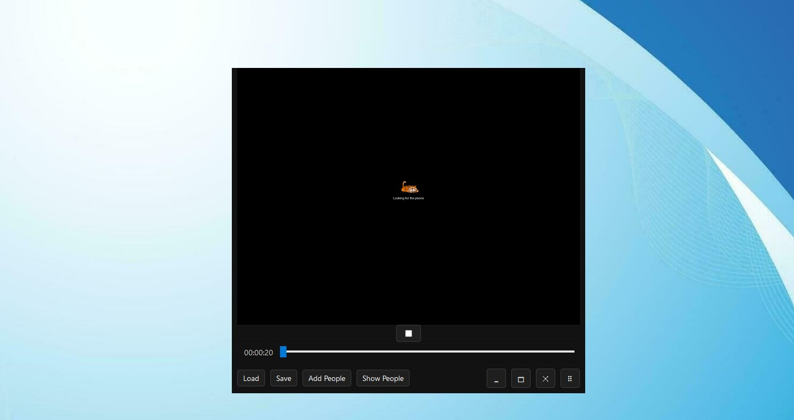
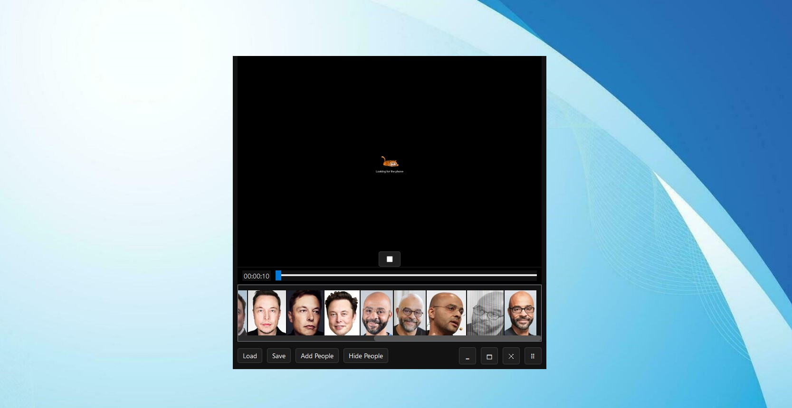
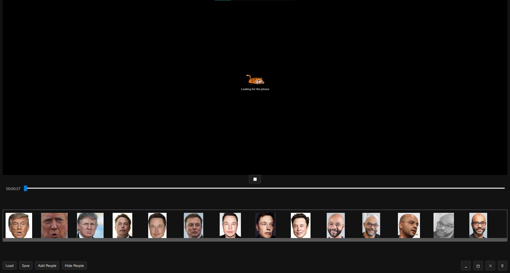
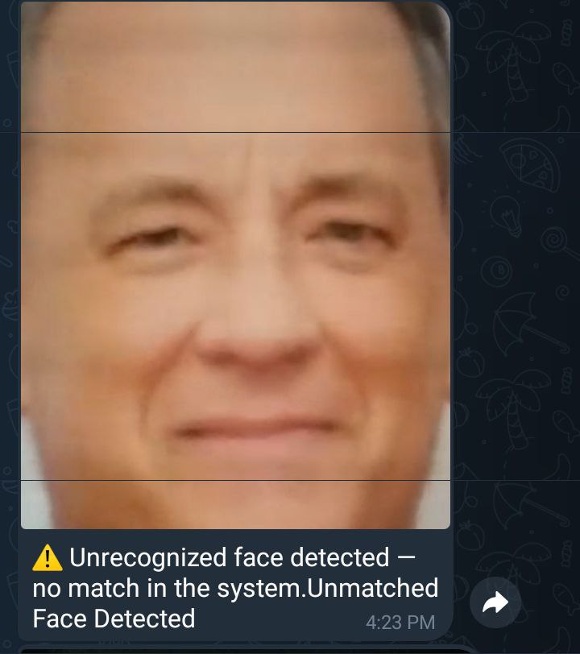
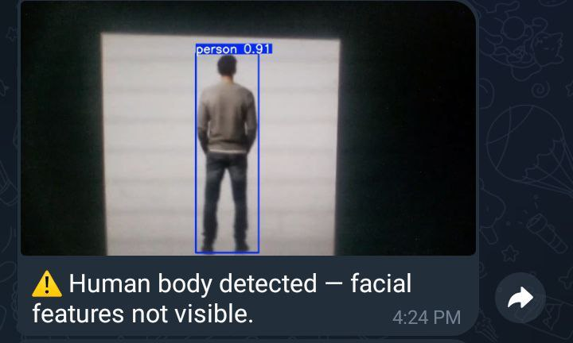

# Thafty: Real-Time Face & Person Detection Surveillance System

## About the Software
Thafty is a cutting-edge, AI-powered surveillance and monitoring application designed for real-time face and person detection in video streams. Built with Python and PyQt5, Thafty integrates advanced computer vision models and deep learning techniques to deliver highly accurate detection, recognition, and alerting capabilities. The software is ideal for security, access control, smart offices, and any environment where automated, intelligent monitoring is required. Thafty not only detects people and faces but can identify known individuals, trigger alarms for unknown or masked faces, and instantly notify users via Telegram.

Thafty is designed with modularity and extensibility in mind. Its architecture separates detection, embedding, matching, and notification services, making it easy to adapt or extend for specialized use cases.

## Software Main Features
- **Real-Time Person Detection:** Uses state-of-the-art YOLO models to detect people in live camera feeds or video streams with high accuracy and speed.
- **Face Detection & Recognition:** Employs SCRFD for robust face detection and DeepFace/EfficientNet for face recognition, supporting both verification and identification modes.
- **Image Embedding & Similarity Search:** Extracts deep embeddings from face images using EfficientNet and performs fast similarity search with FAISS, enabling instant recognition even in large databases.
- **Visual Alarm System:** Automatically issues alarms for detected persons, unknown faces, or covered faces, with clear visual feedback in the user interface.
- **Instant Telegram Notifications:** Sends real-time alerts to a configured Telegram chat when alarms are triggered, ensuring you are always informed of unusual events.
- **Modern User Interface:** PyQt5-based GUI provides a live camera view, intuitive controls for managing known people, and easy access to all features.
- **Flexible Database Management:** Add, save, and load face databases, manage known people, and update the recognition system on the fly.
- **Configurable & Extensible:** All major parameters (model paths, thresholds, notification settings) are easily configurable in a single file.

## How to Install the Software (with venv)

1. **Clone the Repository**
   ```bash
   git clone https://github.com/DeepActionPotential/Thafty
   cd Thafty
   ```
2. **Create a Virtual Environment (Recommended)**
   - On Windows:
     ```bash
     python -m venv venv
     venv\Scripts\activate
     ```
   - On macOS/Linux:
     ```bash
     python3 -m venv venv
     source venv/bin/activate
     ```
3. **Install Dependencies**
   ```bash
   pip install -r requirements.txt
   ```
4. **Download Required Models**
   - Download the ONNX, PyTorch, and DeepFace models referenced in `config.py` and place them in the `models/` directory. Example models:
     - `./models/det_10g.onnx` (SCRFD face detector)
     - `./models/yolov8n.pt` (YOLO person detector)
     - `./models/efficientnet_b0.pth` (EfficientNet for embeddings)
     - DeepFace models in `./models/`


## Software Configurations
All main configuration options are centralized in `config.py` under the `DefaultCfg` dataclass. You can customize the following:
- **Model Paths:**
  - `face_model_path`: Path to the ONNX face detection model (e.g., `./models/det_10g.onnx`)
  - `person_model_path`: Path to the YOLO model (e.g., `./models/yolov8n.pt`)
  - `embedding_model_path`: Path to the EfficientNet model (e.g., `./models/efficientnet_b0.pth`)
  - `deepface_models_path` & `deepface_model_name`: DeepFace model settings
- **Thresholds & Parameters:**
  - `face_threshold_probability`: Face detection confidence threshold
  - `person_confidence_threshold`: Person detection confidence threshold
  - `faiss_manager_top_k`: Number of top matches to retrieve from FAISS
  - `matching_top_k`: Number of top matches for face matching
  - `found_coverd_body_alarm_wait`: Wait time before triggering alarm for covered faces
  - `frame_analysis_interval_wait_in_seconds`: Time interval between frame analyses
- **Telegram Settings:**
  - `telegram_bot_token`: Your Telegram bot token
  - `notification_chat_id`: The chat ID to receive notifications
- **Data Paths:**
  - `known_people_info_path`: Directory for storing and loading known people's images

To update any setting, simply edit the value in `config.py` and restart the application.


## DEMO

### [demo-video](demo/thafty_demo.mp4)









## How to Use the Software

- Note: fill the needed config file before starting.

1. **Start the Application**
   ```bash
   python app.py
   ```
2. **Live Monitoring**
   - The main window will display the live camera feed with overlays for detected people and faces.
   - Recognized individuals will be labeled, and unknown or masked faces will trigger alarms.
3. **Managing Known People**
   - there is a konwn-people data sample in the data folder. when adding a new people, the NEW known people folder should have the same strucutre.
   - Use the toolbar to add new images or folders of known people to the database.
   - Save and load face databases for persistent storage and fast startup.
   - The known people bar lets you view and manage all registered faces.
4. **Alarms & Notifications**
   - Visual alarms appear in the UI for unknown faces, covered faces, or recognized individuals.
   - If Telegram is configured, notifications are sent instantly to your chat.
5. **Configuration Adjustments**
   - Change detection thresholds, model paths, and notification settings in `config.py` to tune performance or adapt to new requirements.
6. **Stopping the Application**
   - Simply close the application window. All resources and camera streams will be released.

## Main Technologies Used (with Focus on FAISS & Image Embedding)

- **Python 3.8+**: The core programming language for all logic and integration.
- **PyQt5**: Provides a modern, cross-platform GUI for real-time visualization and user interaction.
- **OpenCV**: Handles image capture, processing, and display operations.
- **YOLO (Ultralytics)**: Delivers fast, accurate person detection in video streams.
- **SCRFD (ONNX)**: An efficient, high-accuracy face detector optimized for real-time use.
- **EfficientNet (PyTorch)**: Used to extract robust, high-dimensional face embeddings for each detected face.
- **FAISS (Facebook AI Similarity Search):**
  - FAISS is a high-performance library for efficient similarity search and clustering of dense vectors.
  - In Thafty, every detected face is embedded as a vector using EfficientNet. These vectors are indexed by FAISS, which enables lightning-fast nearest neighbor searches even in large face databases.
  - FAISS supports both exact and approximate search, and can leverage CPU or GPU for acceleration.
  - This architecture allows Thafty to recognize known individuals in real time, regardless of database size.
- **DeepFace**: Provides advanced face verification and recognition capabilities, supplementing the embedding and matching pipeline.
- **ONNX Runtime**: Enables fast, cross-platform inference for ONNX models (e.g., SCRFD face detector).
- **python-telegram-bot**: Integrates Telegram messaging for instant, remote notifications.
- **scikit-learn, tqdm, requests, pillow, matplotlib**: Utilities for data processing, progress reporting, image handling, and visualization.

### In-Depth: FAISS & Image Embedding

#### Image Embedding
- The software uses EfficientNet, a state-of-the-art deep neural network, to convert each detected face into a high-dimensional embedding (vector).
- These embeddings capture the unique visual features of each face, making them robust to changes in lighting, pose, and background.
- The embedding process is fast and can be performed on CPU or GPU, depending on your hardware.

#### FAISS (Similarity Search)
- FAISS (Facebook AI Similarity Search) is used to store and search face embeddings efficiently.
- When a new face is detected, its embedding is compared against the database using FAISS to find the closest matches.
- This enables instant recognition of known individuals, even when the database contains thousands of faces.
- FAISS supports both exact and approximate nearest neighbor search, making it highly scalable.
- The combination of deep embeddings and FAISS ensures high accuracy and speed, which are critical for real-time surveillance.

